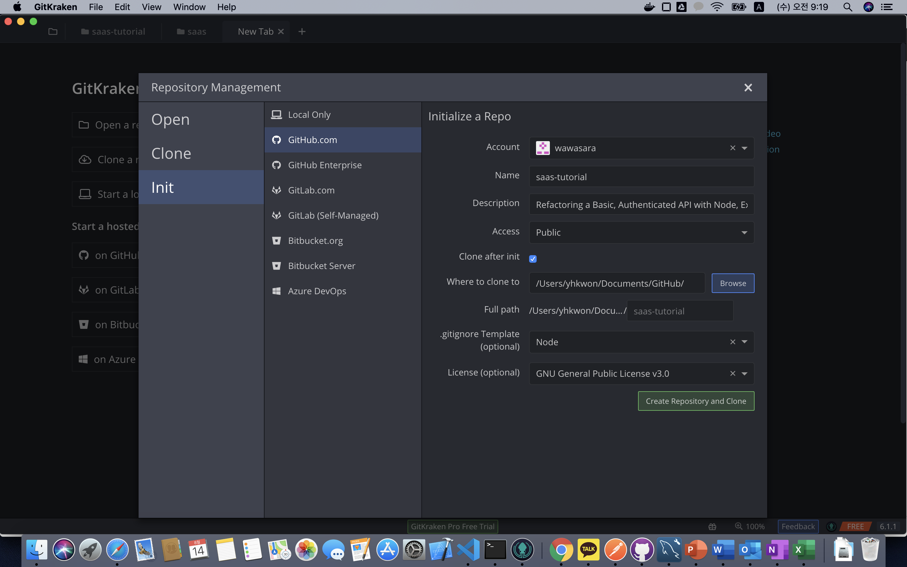
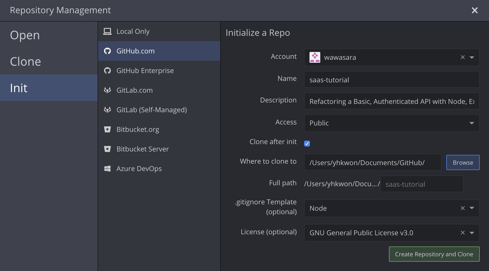

# Refactoring a Basic, Authenticated API with Node, Express and MongoDB

## Step 1: Scaffolding

GitKraken 에서 새로이 GitHub.com 에 saas-tutorial Repo 를 생성합니다.





Init &gt; GitHub.com &gt; Account 선택

* Name: saas-tutorial
* Access: Public / Private 선택
* Clone after init: checked
* .gitignore Template: Node
* License: GNU General Public License 3.0 \(GPL 3.0\)

.gitignore 의 "\#Dependency directory" 에 node\_modules 경로를 추가합니다.



```javascript
client/node_modules
server/node_modules
```



폴더 구조 만들기

클라이언트 폴더를 아래와 같이 만듭니다.

```bash
/src
|----/actions
|----/components
|----/public
     /----/stylesheets
     /----/img
!----/reducers
```

```bash
mkdir client server

cd client
mkdir src src/actions src/components src/public src/reducers
mkdir src/public/stylesheets src/public/img
```

서버 폴더를 아래와 같이 만듭니.

```bash
/config
|----/main.js
/controllers
/models
index.js
package.json
router.js
```

```bash
cd ../server
mkdir config controllers models
touch config/main.js index.js package.json router.js
```


